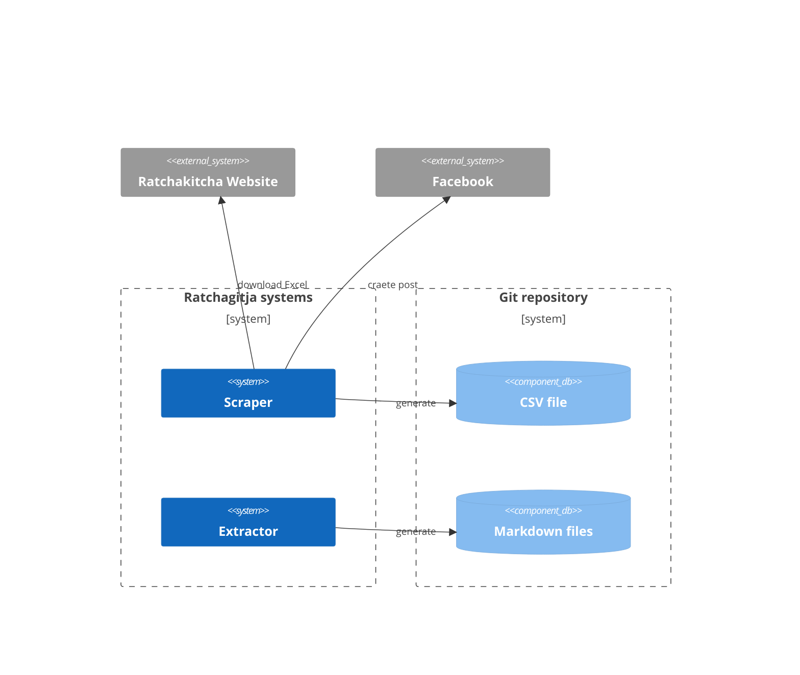
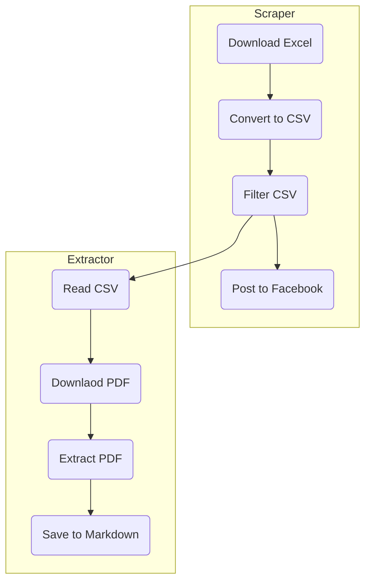

# Ratchagitja.md

แปลงราชกิจจานุเบกษา ให้เป็นรูปแบบที่คอมพิวเตอร์อ่านและประมวลผลต่อได้ง่ายขึ้น


## Rules

- แปลงตรงตามตัวอักษร
- ตัวเลขไทยทั้งหมดแปลงเป็นเลขอารบิก (ใช้ [UnSarabun](https://github.com/narze/unsarabun.js) ช่วยได้)
- Example [Template](TEMPLATE.md)
- มี Metadata ที่จำเป็น (ใช้ [YAML Frontmatter](https://markdoc.dev/docs/frontmatter))
  - name: ซื่อประกาศ
  - date: วันที่ yyyy-mm-dd
  - category: ประเภท
  - volume: เล่ม
  - section: ตอนที่
  - page: หน้า
  - source: URL ที่มาของประกาศ
  - อื่นๆ (ถ้ามี)
- ตัดข้อมูลที่ไม่จำเป็นออกไป เช่น หัวกระดาษ (Page Header)

\* หมายเหตุ

ถ้ามีข้อมูลที่แปลงเป็นตัวอักษรไม่ได้ เช่น รูปภาพ หรือ ตารางข้อมูลที่มีขนาดใหญ่มาก ให้เขียนเป็นหมายเหตุเอาไว้ก่อน แล้วจะแก้ไขให้เป็น Markdown หรือ HTML ต่อไป

## System design



# Workflows



## Project layout

```tree
├── data
│   ├── filter.json                      - list of filters by title start with
│   ├── ratchakitcha.csv                 - list of ratchakitcha CSV file
│   ├── ratchakitcha_filtered.csv        - filtered list of ratchakitcha CSV file
├── entries                              - ratchakitcha Markdown files, path `category/volume/section/id.md`
│   ├── ก                                - categories directories
|   │   ├── 139                          - volumes directories
|   │   │   ├── 61                       - sections directories
|   │   │   │   ├── 17224570.md          - ratchakitcha Markdown file
├── extractor                            - extractor script for download PDF and extract to Markdown files           
└── scraper                              - scraper script for download Excel and parser to CSV
```

## Contribution

- เลือกราชกิจจานุเบกษาจากเว็บไซต์ https://ratchakitcha.soc.go.th แปลงเป็น Markdown หรือ txt แล้วเปิด Pull Request
- สร้าง Issue เพื่อเสนอแนะ หรือ แจ้งปัญหา
- ช่วยกันตรวจสอบความถูกต้องของข้อมูลใน Pull Request
